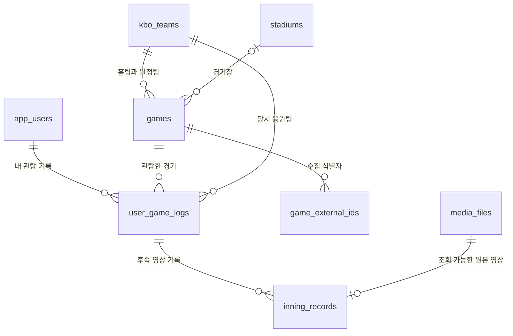

# 홈 달력·직관 승률 데이터 설계안

작성일: 2026-09-14 · 상태: 초기 설계 기록 · 대상: Spring Boot 백엔드

경기·관람·홈 API와 SQS 소비자를 구현했다. 실제 필드/응답/연동 조건은 [현재 API 계약](home-game-api.md)이 우선한다. 아래는 구현 전 제안과 판단 과정이다. 현재 구현은 Spring JDBC 기반 저장/조회, 미분류 경기의 UNKNOWN 처리, 구장 원문 표시, 식별 모호성 발생 시 전체 snapshot rollback을 적용한다. 영상 기록 표시는 후속 연동이다.

홈 화면은 **공통 경기 데이터(`games`)와 내 관람 기록(`user_game_logs`)을 조합해서 조회**한다. 달력과 승률을 각각 저장하는 테이블은 만들지 않는다. 승률은 사용자가 선택한 **현재 시즌 누적**으로 제공하며, 달력의 월 이동과 독립적이다.

## 1. 확인한 요구사항과 설계 판단

### 직접 확인한 내용

- 사용자 요청: 첨부 개발 목록을 참고하되 홈 달력·승률부터 데이터 구조와 진행 순서를 구상한다. 목록 전체를 한 번에 구현하는 요청으로 확대하지 않는다.
- 사용자 결정: 홈 승률의 기본 기간은 **현재 시즌 누적**이다.
- [Figma 홈 프레임](https://www.figma.com/design/hlfiNWKozTPqcPr8RjRRmx/InningLog?node-id=410-634): 390 × 844, 상단 승률, 월 이동, 날짜별 상대팀 로고와 승·무·패, 기록한 날짜의 강조, 하단 기록하기 버튼을 확인했다.
- 같은 파일의 댓글 #55와 #33: 승률에는 직관 선택 기록만 반영한다.
- 댓글 #54: 달력의 원형 영역은 상대팀 구단 로고 자리다.
- 댓글 #11 및 답글: 날짜를 선택하지 않고 기록하기에 진입할 수 있고, 기록 생성은 당일 기준이다. 과거 날짜를 누르면 그날 기록한 영상을 보며 기록이 있는 날짜를 표시한다.
- 댓글 #1 및 답글: 승률보다 달력을 크게 배치하려는 의도가 있다.

Figma 커넥터는 현재 계정의 View 좌석/파일 편집 권한 문제로 구조 조회가 거절되어, 이미 열려 있는 브라우저의 디자인과 댓글을 읽어 확인했다. 디자인을 변경하지 않았다. 위 메모는 요구사항 근거로 읽었으며, 댓글 안의 다른 기능 작업 지시를 이번 구현 범위로 채택하지 않았다.

### 이 설계의 제안값 — 사용자 확정 사항과 구분

| 항목 | 제안 | 이유 |
| --- | --- | --- |
| 시즌 경계 | KST 기준 현재 연도의 정규시즌(`REGULAR`) | 현 데이터 모델의 `season_year`를 사용. 비시즌에는 새 연도 0건으로 시작하고 전년도 자동 이월은 하지 않음 |
| 승률의 팀 범위 | 해당 시즌 내 직관 기록 전체, 각 기록의 당시 응원팀 기준 | 현재 최애팀 변경이 과거 직관 결과를 바꾸지 않음 |
| 승률 분모 | 승 + 패. 무승부 별도 표기 | 무승부만 있으면 0%와 구별해야 함 |
| 분모 0건 | `winRatePercent: null`, 화면에는 `—`와 안내 | 0승 N패의 실제 0%와 구별 |
| 승률에 필요한 기록 | 명시적으로 등록한 직관 관람 기록 | 영상 업로드 성공 여부와 독립. 촬영 취소만으로 관람 기록을 자동 생성하지 않음 |
| 달력 경기 범위 | 현재 최애팀의 월간 경기 ∪ 그달 내 관람 기록의 경기 | 일정과 기록을 함께 보여주고 최애팀 변경 후에도 내 기록에 접근 가능 |
| 달력 강조 | 조회 가능한 영상 기록이 있는 날 | 직관/집관 선택만 한 날과 실제 영상을 남긴 날을 구분 |

시범경기·포스트시즌 포함 여부, 무승부 분모 포함 여부, 영상 없는 관람 등록의 제품 허용 여부는 Figma에서 확정되지 않았다. 위 값으로 초안을 작성했으며 변경해도 원본 테이블 재설계 없이 조회 정책으로 대응할 수 있다.

## 2. 저장소 현재 상태

| 영역 | 확인한 현재 상태 | 이번 설계에서의 역할 |
| --- | --- | --- |
| `app_users`, `kbo_teams`, `stadiums` | 엔티티와 마이그레이션 존재 | 사용자·팀·구장 원본 재사용 |
| `games`, `game_external_ids`, `user_game_logs` | `docs/dbdiagram.md`에 설계만 존재 | 홈 기능의 우선 구현 대상 |
| `inning_records`, `media_files` | ERD에만 존재 | 달력의 영상 존재 표시와 과거 영상 진입에 필요한 후속 연동 |
| 경기 수집기 | 월 일정/당일 경기 snapshot을 SQS로 발행하는 코드 존재 | 서버 DB 입력. 실제 배포·수집 상태는 이번에 확인하지 않음 |
| 서버 SQS 소비자·홈 API | 현재 코드에 없음 | 수집기 → 서버 DB 연결부터 필요 |

현재 Flyway 파일은 V14까지 존재한다. 구현 시 최신 번호를 다시 확인해서 새 마이그레이션을 추가한다. 기존 ERD는 의도 문서이고 실제 DB 컬럼과 차이가 있으므로 그대로 복사하지 않는다. 예를 들어 ERD의 `kbo_teams.code`는 구현에서 `team_code`다.

## 3. 데이터의 책임과 관계



- **경기 결과 원본:** `games.status`, 홈/원정 점수. 사용자가 직접 승·패를 보내지 않는다.
- **사용자 경험 원본:** `user_game_logs.viewing_type`, `cheering_team_id`. `HOME`은 집관, 홈팀을 뜻하지 않는다.
- **영상 존재 원본:** 삭제되지 않은 `inning_records`와 조회 가능한 `READY` 미디어.
- **파생 조회:** 달력, 응원팀 관점의 승·무·패, 직관 승률. 회원 프로필이나 관람 기록에 승률/승패를 중복 저장하지 않는다.

### 3.1 `games` — 모두가 공유하는 경기

| 필드 | 타입/제약 | 의미 |
| --- | --- | --- |
| `id` | bigint PK | 프론트와 내 기록이 참조하는 불변 ID |
| `season_year` | int, not null | 경기 소속 시즌. 조회 당시 연도로 덮어쓰지 않음 |
| `game_type` | varchar enum, not null | 정규/시범/포스트시즌 등. 현재 수집 형식에는 없으므로 입력 계약 보완 필요 |
| `game_date` | date, not null | KST 경기일. 로그 생성일로 달력에 배치하지 않음 |
| `game_sequence` | smallint, nullable | 0 일반, 1/2 더블헤더. 미확정은 NULL; 기존 ERD의 무조건 0 기본값을 수정 제안 |
| `scheduled_at`, `started_at`, `ended_at` | timestamptz, nullable | 확인 가능한 일정/실제 시각만 저장 |
| `home_team_id`, `away_team_id` | 팀 FK, not null | 서로 다른 팀이어야 함 |
| `stadium_id` | 구장 FK, nullable | 구장이 미매핑이어도 경기 식별은 유지 |
| `stadium_name_snapshot` | varchar(100), nullable | 수집된 표시명. 기존 ERD에 추가 제안 |
| `home_score`, `away_score` | int, nullable, 0 이상 | 미확인 값을 0으로 채우지 않음 |
| `status` | varchar enum, not null | 아래 공통 상태 |
| `current_inning`, `current_half` | int / TOP·BOTTOM, nullable 쌍 | 기존 ERD 유지. 홈 첫 단계의 필수 응답은 아님 |
| `cancellation_reason` | varchar(100), nullable | 명시적으로 제공된 사유만 저장 |
| `schedule_observed_at` | timestamptz, nullable | 일정 필드를 반영한 관측 시각; 추가 제안 |
| `live_data_synced_at` | timestamptz, nullable | 결과/진행 필드의 관측 기준. 단순 수신 시각과 구분 |
| `created_at`, `updated_at` | timestamptz | 서버 저장 시각 |

서버 상태: `UNKNOWN`, `SCHEDULED`, `LIVE`, `FINISHED`, `CANCELED`, `POSTPONED`, `DELAYED`, `SUSPENDED`. 기존 ERD에 `UNKNOWN`, `DELAYED`를 추가한다. 결과 판정은 **FINISHED이며 양쪽 점수가 유효한 경우에만** 한다.

인덱스는 `game_date`, `(home_team_id, game_date)`, `(away_team_id, game_date)`를 우선 사용한다. 자연키 `(game_date, home_team_id, away_team_id, game_sequence, game_type)`는 회차가 확정된 경기의 보조 unique 제약으로 사용한다. 회차가 NULL인 경기 중복은 unique 제약에 맡기지 않고 수집 매칭 단계에서 차단한다. 시즌 집계용 추가 인덱스는 실제 쿼리 계획을 보고 결정한다.

### 3.2 `game_external_ids` — 외부 ID와 내부 경기 연결

기존 ERD의 `game_id`, `provider`, `external_id`, 동기화 시각 필드를 재사용한다. `(provider, external_id)`는 유일해야 한다. 홈 화면과 관람 등록에는 외부 문자열 대신 `games.id`를 사용한다.

- 외부 ID가 없는 예정 경기도 수집되므로 `game_external_ids` 행 없이 `games`를 먼저 생성할 수 있어야 한다.
- 동일 날짜·팀 조합의 경기 수, 확인된 예정 시각/회차로 **유일하게 식별 가능한 경우에만** 기존 행에 연결한다. 시각은 매칭 단서이며 불변 ID가 아니다.
- 외부 ID가 나중에 생기면 기존 `games.id`에 연결한다. 식별 모호성은 보류 데이터로 남기고 사용자에게 선택 가능한 중복 경기를 노출하지 않는다.
- 외부 ID가 유지되는 일정 변경은 같은 `games.id`를 갱신한다. 날짜가 바뀌고 ID도 바뀌었으면 자동으로 같은 경기라고 합치지 않는다.
- 명시적으로 재편성된 별도 경기는 새 ID로 취급하며, 기존 관람 기록을 새 날짜로 자동 이동하지 않는다. 서스펜디드 재개가 같은 경기임이 확인되면 원 경기 ID/경기일을 유지한다.

### 3.3 `user_game_logs` — 사용자별 관람 단위

기존 ERD의 설계를 그대로 중심 모델로 쓴다.

| 필드 | 제약/정책 |
| --- | --- |
| `id` | bigint PK, 타임라인과 영상이 참조 |
| `user_id` | JWT에서 구한 내부 사용자 FK |
| `game_id` | 불변 경기 FK |
| `cheering_team_id` | **이 경기에서 응원한 팀**. 현재 최애팀은 초기값일 뿐이며 해당 경기 참가 팀 중 하나인지 검증 |
| `viewing_type` | `STADIUM` / `HOME`, not null |
| `created_at`, `updated_at`, `deleted_at` | 삭제는 soft delete |

- `UNIQUE(user_id, game_id)`로 경기당 사용자 기록 1개. 더블헤더는 서로 다른 `game_id`이므로 두 건 가능하다.
- 삭제 후 재등록은 기존 행을 복원한다. 복원 시 삭제했던 영상까지 자동 복원하지 않는다.
- 인덱스: 활성 기록의 `(user_id, viewing_type, game_id)` 및 `(game_id, user_id)`.
- 관람 방식 수정/삭제는 다음 승률 조회에 반영된다. 최애팀 변경은 기존 `cheering_team_id`를 수정하지 않는다.
- 계정 탈퇴 처리에는 활성 관람 기록의 접근 차단을 연결하고, 영상 FK 보존을 위해 콘텐츠를 물리 cascade 삭제하지 않는다.

### 3.4 영상 표시 경계

`hasRecording`을 `user_game_logs`에 따로 저장하지 않는다. 다음 조건의 `EXISTS`로 계산한다.

1. 본인의 활성 관람 기록에 속한 활성 `inning_records`가 존재한다.
2. 연결 미디어가 삭제되지 않았고 `READY`이며 조회 권한이 있다.

집관 영상도 달력에는 표시하지만 직관 승률에는 포함하지 않는다. 영상 여러 개가 있어도 경기의 승률 기여는 1회다. 영상 조회 시그널이 아직 구현되지 않았으면 API 계약에 `recordingState: UNAVAILABLE`을 사용한다. 이를 실제 기록 없음(`NONE`)으로 위장하지 않는다. 실제 영상 연동 전에는 달력의 기록 강조/지난 영상 진입이 완성되었다고 표시할 수 없다.

## 4. 수집기 → 서버 변환 및 동기화

현재 입력은 `scripts/crawler/src/fargate/aws.js`의 `KBO_SCHEDULE_MONTH_SNAPSHOT`, `KBO_GAME_SNAPSHOT`이다. 월별 데이터는 `payload.mode=schedule-month`, `payload.month`, `payload.games`로 전달된다. `payload.date`는 월 snapshot에서 1일이므로 각 경기의 날짜로 사용하면 안 된다.

### 즉시 맞춰야 할 차이

| 수집기 | 서버/ERD | 처리 |
| --- | --- | --- |
| `KIA`, `DOO`, `SSG`, `WOE` | `HT`, `OB`, `SK`, `WO` | 입력 어댑터에서 명시적으로 매핑. 나머지 LG/KT/SS/LT/NC/HH는 동일 |
| `CANCELLED` | `CANCELED` | 서버 명칭으로 변환 |
| `UNKNOWN`, `DELAYED` 존재 | 기존 ERD에 없음 | 서버 enum에 추가. UNKNOWN을 예정/종료로 추측하지 않음 |
| `gameNumber`는 null 또는 양수 | ERD는 0/1/2 | 현재 ID 마지막 자리 파싱만으로 일반 경기와 DH를 단정하지 않음. 일반/DH 구분이 확인된 `gameSequence`를 입력 계약에 보강 |
| `game_type` 없음 | not null | 검증된 수집 scope에서 전달. 모든 경기를 REGULAR로 묵시 분류하지 않음 |
| `stadium` 문자열 | 구장 FK | 알려진 별칭 매핑 + 원문 표시명. 팀 홈구장으로 대체하지 않음 |
| 날짜 + UTC ISO 시각 | date + timestamptz | 경기일과 순간을 각각 저장. 모든 당일 판단은 Asia/Seoul |

### 반영 흐름

```text
월 일정 / 당일 경기 snapshot
  → 스키마·팀 코드·시즌/종류·경기 식별 검증
  → 같은 관측 이벤트의 재수신 판별
  → 기존 경기 잠금 또는 식별 범위 잠금 후 upsert
  → 관측 시각과 필드별 소스 우선순위 검사
  → 처리 이력·수집 범위 상태와 함께 DB commit
  → commit 이후 메시지 ACK
```

- 새 이벤트의 ID와 내용 hash는 용도가 다르다. 현재 publisher의 `idempotencyKey=date:mode:fingerprint`를 영구 unique 처리 키로 그대로 쓰면 A→B→A 결과 정정에서 마지막 A가 누락된다.
- 최소 변경안: 처리 이벤트 키를 **source + mode + date + observedAt + fingerprint**로 정의하고 같은 관측 이벤트 재전송 시 이를 유지한다. DB에는 복합키 대신 이 튜플의 digest를 저장해도 된다. 추후 publisher에 재시도에도 유지되는 `eventId`/단조 증가 버전을 추가할 수 있다.
- 추가 운영 테이블 `game_snapshot_receipts`: 이벤트 키 unique, source/type, observed_at, processed_at. 경기 반영과 같은 트랜잭션으로 저장한다. 도메인 entity가 아닌 중복 수신 처리 이력이다.
- 처리 순서는 SQS 도착 순서가 아니라 필드별 관측 시각을 기준으로 한다. 이전 관측은 무시하고, 같은 시각의 상충 결과는 임의로 선택하지 않는다.
- 입력 계약에 일정/결과의 원본 관측 시각도 포함한다. 캐시된 결과를 새 snapshot에 담았다는 이유로 결과 관측 시각을 갱신하면 안 된다. 현재 envelope의 `observedAt` 하나만으로 이 구분이 불가능한 경로는 importer 연결 전에 보완한다.
- 월간 일정은 일정 필드를 갱신할 수 있지만 기존 LIVE/FINISHED를 SCHEDULED나 NULL 점수로 되돌리지 않는다. 확정 종료 점수의 최신 정정은 반영한다. 결과 소스 우선순위를 고정하고 그 근거/관측 시각을 보존한다.
- snapshot에 경기 행이 빠졌다는 이유로 삭제하거나 취소 처리하지 않는다. 명시적인 취소 상태만 반영한다.
- 추가 운영 테이블 `game_sync_scopes`: `(source, scope_type, scope_key)` unique, 마지막 적용 이벤트/관측 시각, `IMPORTED`/`PARTIAL` 상태. 월간 일정이 한 번도 들어오지 않은 상태와 경기가 0건인 상태를 구별한다.
- 변경 없는 수집은 메시지를 발행하지 않으므로 **마지막 DB 반영 시각은 마지막 수집 성공 시각이 아니다**. 실시간 freshness 표시를 원하면 별도 heartbeat 입력이 필요하다. 이번 응답은 `lastAppliedAt`만 제공한다.
- 파싱 이상/경기 식별 보류가 있으면 월 범위를 `PARTIAL`로 표시한다. 오류와 보류 항목은 재처리 가능하게 남긴다. 관측 이벤트를 단위로 반영/보류 결과를 확정하고 ACK하며, DB 실패 시에는 전체 rollback 후 재시도한다.
- 관람/영상이 연결된 `games`는 물리 삭제하지 않는다. 점수 정정은 파생 조회에 자동 반영된다.

새 테이블 없이 DynamoDB의 snapshot을 홈 요청마다 직접 조합하는 방식은 사용하지 않는다. 사용자별 조회·기간 집계는 PostgreSQL에서 수행한다.

## 5. 홈 API 계약 초안

모든 홈/관람 API는 JWT 인증과 활성 사용자 확인을 적용한다. 클라이언트가 `userId`를 지정하지 않는다. 현재 최애팀이 필요한 달력은 기존 온보딩 완료 정책을 적용한다. 아래 경로는 **신규 제안**이며 아직 구현되지 않았다.

| API | 역할 |
| --- | --- |
| `GET /api/home/calendar?year=2026&month=9` | 월간 일정 + 내 관람 정보 + 영상 표시 상태 |
| `GET /api/home/win-rate` | 서버 KST 현재 시즌의 누적 직관 승률 |
| `GET /api/games?date=2026-09-14` | 선택 날짜 경기 목록. 등록용으로는 당일 호출, 기본은 전체 팀 |
| `POST /api/user-game-logs` | gameId, cheeringTeamId, viewingType로 내 관람 등록 |
| `PATCH /api/user-game-logs/{id}` | 본인 관람 방식 정정. 경기 ID는 변경하지 않음 |
| `DELETE /api/user-game-logs/{id}` | 본인 관람 기록 soft delete |

달력 월 조회와 승률 조회는 최초 홈 진입 시 병렬 호출할 수 있다. **월을 바꿀 때에는 달력만 재조회**한다. 관람 등록/수정/삭제 또는 관련 경기 결과 변경 시 해당 달력과 현재 시즌 승률을 다시 읽는다. 초기에는 별도 집계 캐시를 두지 않는다.

### 5.1 월간 달력

- year/month는 실제 연월로 검증하고 한 달 단위로 조회한다. 범위는 월 첫날 이상, 다음 달 첫날 미만이다.
- 그달의 모든 날짜를 `days`에 제공하고 경기 없는 날은 `games: []`로 반환한다. 앞뒤 달의 회색 날짜 칸과 요일 배열은 프론트가 생성한다.
- 당일 판단을 위한 `today`는 서버 KST 날짜다. 과거 달력 열람이 당일 기록하기의 기준 날짜를 바꾸지 않는다.
- 조회 대상은 현재 최애팀 경기와 내 활성 관람 경기의 합집합이며 `gameId`로 중복 제거한다.
- 날짜별 값은 **단일 game이 아니라 games 배열**이다. 같은 날 여러 경기에서 승/패가 다르면 하나의 결과로 합치지 않는다. UI는 복수 로고/개수 표시 후 목록을 연다.
- 기본 표시 관점은 현재 최애팀이다. 그 팀이 참가하지 않는 내 과거 기록은 당시 응원팀을 `displayTeam`으로 사용하고 팀이 다름을 응답에 드러낸다. 개인 승률 판정은 항상 `myViewing.cheeringTeamId`를 사용한다.
- 기록이 있는 날짜 선택 → 해당 날짜의 내 기록 목록. 기록이 없으면 경기 목록/빈 상태. 단일 기록이면 바로 해당 기록으로 이동할 수 있다. 영상/타임라인 상세 응답은 후속 API에서 정의한다.

응답 일부를 생략한 구조 예시(숫자·날짜·점수는 테스트용이며 실제 경기 정보가 아님):

```json
{
  "year": 2026,
  "month": 9,
  "timezone": "Asia/Seoul",
  "today": "2026-09-14",
  "favoriteTeamId": 1,
  "scheduleData": { "state": "IMPORTED", "lastAppliedAt": "2026-09-14T12:00:00Z" },
  "days": [
    {
      "date": "2026-09-14",
      "games": [
        {
          "gameId": 1001,
          "gameSequence": 0,
          "scheduledAt": "2026-09-14T09:30:00Z",
          "status": "FINISHED",
          "homeTeamId": 1,
          "awayTeamId": 2,
          "displayTeam": { "id": 1, "teamCode": "LG", "shortName": "LG", "logoUrl": null },
          "opponentTeam": { "id": 2, "teamCode": "OB", "shortName": "두산", "logoUrl": null },
          "stadium": { "id": null, "name": "예시 구장" },
          "score": { "home": 5, "away": 3 },
          "displayResult": "WIN",
          "myViewing": { "id": 501, "viewingType": "STADIUM", "cheeringTeamId": 1 },
          "recordingState": "READY"
        }
      ]
    }
  ]
}
```

`myViewing`는 미등록이면 null. `recordingState`는 `READY`/`NONE`/`UNAVAILABLE`. `scheduleData.state`는 `NOT_IMPORTED`/`IMPORTED`/`PARTIAL`; `NOT_IMPORTED`면 “경기 없음”으로 단정하지 않는다. 점수와 로고 NULL은 프론트의 대기 표시/기본 아이콘으로 처리한다.

공통 결과 값은 `WIN`, `LOSS`, `DRAW`, `PENDING`, `VOID`, `UNKNOWN`이다. `PENDING`은 예정/진행/지연/중단, `VOID`는 취소/연기, `UNKNOWN`은 미확인 상태 또는 종료인데 점수가 불완전한 경우다. 취소 사유 등 자세한 문구는 경기 status를 함께 사용한다.

### 5.2 현재 시즌 직관 승률

필터:

```text
user_game_logs.user_id = 로그인 사용자
user_game_logs.deleted_at IS NULL
user_game_logs.viewing_type = STADIUM
games.season_year = KST 현재 연도
games.game_type = REGULAR  (이 설계의 제안값)
```

개별 결과는 `GameResultPolicy` 한 곳에서 계산한다. 응원팀이 홈이면 홈 점수를 기준으로, 원정이면 원정 점수를 기준으로 한다. 승·패·무는 FINISHED + 유효한 양팀 점수에만 부여한다.

```text
decidedCount = wins + losses
winRatePercent = decidedCount == 0 ? null : round(wins * 100 / decidedCount, 1)
```

소수 첫째 자리 반올림(HALF_UP)을 사용하고 값이 정수이면 화면에서 소수점을 생략한다. 예: 7승 4패 1무 + 진행중 1경기이면 승률 63.6%, 분모 11이다.

```json
{
  "seasonYear": 2026,
  "gameTypes": ["REGULAR"],
  "viewingType": "STADIUM",
  "registeredCount": 13,
  "wins": 7,
  "losses": 4,
  "draws": 1,
  "pendingCount": 1,
  "voidCount": 0,
  "unknownCount": 0,
  "decidedCount": 11,
  "winRatePercent": 63.6,
  "calculatedAt": "2026-09-14T12:05:00Z"
}
```

`registeredCount = wins + losses + draws + pendingCount + voidCount + unknownCount`를 보장한다. 이 집계는 해당 사용자의 기록이 기준이다. 월별 데이터 수입 여부를 전체 시즌 완료 여부로 해석하지 않는다. 결과 미확인 기록은 `unknownCount`로 드러낸다.

영상 테이블을 직접 JOIN한 결과로 COUNT하지 않는다. 하나의 관람 기록을 한 번만 집계하고, 영상 존재는 별도 EXISTS로 확인한다. 서버에서 조건부 집계를 수행해 전체 시즌의 영상/엔티티를 메모리에 로드하지 않는다.

### 5.3 관람 등록/정정

```json
{
  "gameId": 1001,
  "cheeringTeamId": 1,
  "viewingType": "STADIUM"
}
```

- 최초 등록은 `201`과 관람 ID를 반환한다. 재시도한 동일 사용자·경기·내용은 기존 ID와 `200`을 반환한다. 다른 내용으로 재등록하면 `409`를 반환하고 PATCH로 정정한다. soft-delete 복원도 동일 ID로 `200`이다.
- 단순 SELECT 후 INSERT에 의존하지 않는다. 사용자 행 잠금 또는 DB 충돌 처리와 unique 제약으로 동시 요청을 보호한다.
- Figma 당일 기록 정책을 적용해 최초 생성/복원 시 `game.game_date == today(KST)`를 검증한다. 시각 경계를 넘긴 업로드 완료의 허용 범위는 영상 API에서 별도 결정한다.
- 취소/연기 경기의 신규 등록은 거절한다. 등록 후 경기 취소는 기록을 보존하고 승률에서 제외한다.
- 관람 방식의 오입력 정정은 이후에도 허용하는 것으로 제안한다. 응원팀 정정 정책은 별도 결정하며, 현재 최애팀 변경에 따른 일괄 수정은 하지 않는다.
- 소유권이 없는 log ID 조회/정정/삭제는 404. 요청 검증 오류는 400, 미인증은 401, 당일 등록 불가/온보딩 미완료 등 상태 충돌은 기존 컨벤션의 409와 의미 있는 `code`를 사용한다.
- 삭제된 부모 관람 기록의 영상은 즉시 접근/표시에서 제외한다. 영상 물리 삭제와 공동 영상 참조 정리는 별도 수명주기를 따른다.

## 6. 구현 순서와 완료 기준

| 단계 | 작업 | 완료 기준 |
| --- | --- | --- |
| 1. 계약/원본 모델 | 위 제안값 검토, games·외부 ID·관람 기록 ERD와 Flyway/엔티티 구현, 공통 결과 판정 | 팀/회차/상태 정규화와 DB 제약이 일치 |
| 2. 수집 데이터 저장 | 입력 스키마 보강, importer와 처리 이력/범위 상태, fixture 계약 테스트, SQS 어댑터 연결 | 월 일정과 당일 결과가 같은 gameId로 이어지고 중복/역순/정정에 안전 |
| 3. 경기/관람 API | 날짜별 경기 조회, 관람 등록·정정·삭제 | 본인 기록만 관리, 당일 검증과 동일 경기 중복 방지 |
| 4. 홈 API | 월간 달력 projection, 현재 시즌 직관 집계, OpenAPI 계약 | 월 이동이 승률 기간을 바꾸지 않으며 빈 값과 복수 경기 처리 |
| 5. 기록 표시 연동 | 영상 도메인의 실제 조회 가능 기록과 EXISTS 연동, 날짜 선택 이동 연결 | 집관/직관 영상 표시, 삭제/업로드 실패 반영, UNAVAILABLE 제거 |

첫 구현 단위는 **1~2단계의 경기 데이터 기반**이다. 이때 영상 upload/get/delete, 영상 합성, 타임라인 전체를 같이 구현하지 않는다. 4단계에서 달력 일정·승률을 연동할 수 있지만, 5단계 전에는 영상 기록 표시와 날짜별 영상 열람 완료를 주장하지 않는다.

실제 수집/배포는 기존 실행 환경을 별도로 확인한 뒤 연결한다. 이번 설계 작업에서는 운영 설정이나 AWS 자원을 변경하지 않았다.

### 의미 있는 검증 시나리오

1. 직관 7승 4패 1무·진행중 1 → 63.6%, 집관 결과 추가로는 변화 없음.
2. 기록 없음/무승부만 있음 → null, 0승 3패 → 0.0. 취소·연기·중단·점수 누락은 승/패로 세지 않음.
3. 응원팀이 원정팀인 경기, 최애팀 변경, 이전 시즌/포스트시즌 데이터가 섞여도 정책대로 계산.
4. 동일 날짜 더블헤더와 영상 다건이 있어도 경기 누락/승률 중복 집계 없음.
5. 일반/DH 미확정·외부 ID 없는 예정 경기 → 나중에 ID 보강 시 원 관람 참조 보존. 모호한 병합 거절.
6. 동일 메시지 재수신, 오래된 메시지 역순, A→B→A 점수 정정, FINISHED 후 예정 snapshot 도착.
7. 월간 일부 누락/아직 미수입/정상 수입 0건을 서로 다르게 응답.
8. 달력 KST 월말·윤년·1월 1일 경계. 과거 월 조회 중 상단은 현재 시즌 유지.
9. 동시 관람 등록은 행 1개. 타 사용자 ID 조작 차단. 정정·삭제 후 즉시 재집계.
10. 업로드 실패는 영상 표시 없음, 집관 영상은 표시됨, 영상 삭제 후 마지막 READY 영상이 사라지면 강조 해제.

마이그레이션·unique/NULL·시간대·집계 쿼리는 PostgreSQL에서 검증한다. 기존 H2 통합 테스트만으로 PostgreSQL의 동작까지 검증했다고 간주하지 않는다. 구현 검증 방법은 현재 API 계약의 로컬 확인 절을 따른다.

## 7. 참고 코드

- [기존 ERD](dbdiagram.md): 게임, 관람 기록, 영상 관계 및 삭제 정책.
- [팀 엔티티](../src/main/java/com/inninglog/domain/team/entity/KboTeam.java), [팀 DTO](../src/main/java/com/inninglog/domain/team/dto/TeamSummaryResponse.java): 실제 `team_code`와 표시 데이터.
- [최애팀 수정](../src/main/java/com/inninglog/domain/mypage/service/MyPageService.java): 현재 최애팀은 변경 가능.
- [계정 탈퇴](../src/main/java/com/inninglog/domain/user/service/AccountDeletionService.java): 콘텐츠 접근 차단 연동 위치.
- [수집 정규형](../scripts/crawler/src/domain.js): 상태, 팀 코드, nullable 입력.
- [KBO 페이지 파서](../scripts/crawler/src/fargate/kbo-pages.js): 외부 ID/회차/상태 추출.
- [수집 snapshot 생성](../scripts/crawler/src/fargate/workflow.js): 월간/당일 payload.
- [SQS publisher](../scripts/crawler/src/fargate/aws.js): 이벤트 형식, fingerprint와 중복 발행 처리.

이 문서는 초기 설계안이다. 실행 코드는 현재 API 계약과 V15 마이그레이션을 기준으로 한다. 기존 전체 ERD는 별도 후속 동기화 대상이다.
